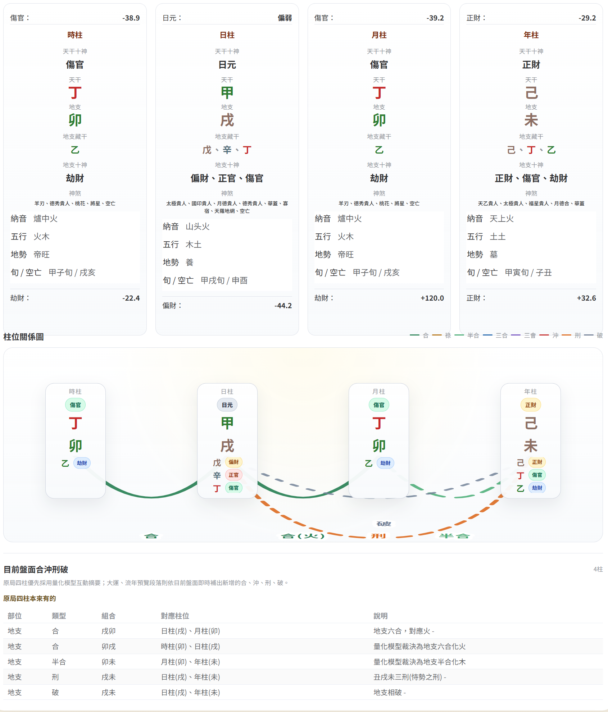
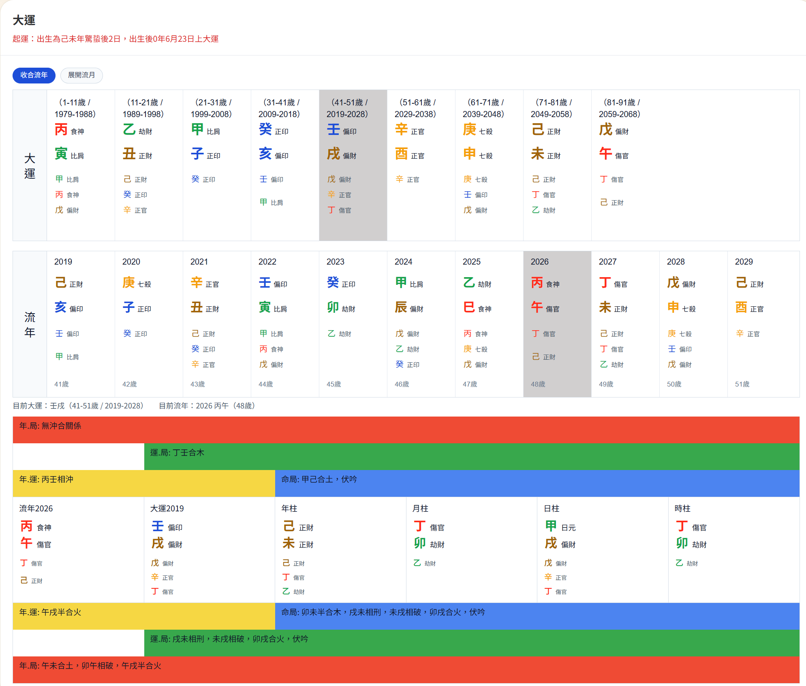
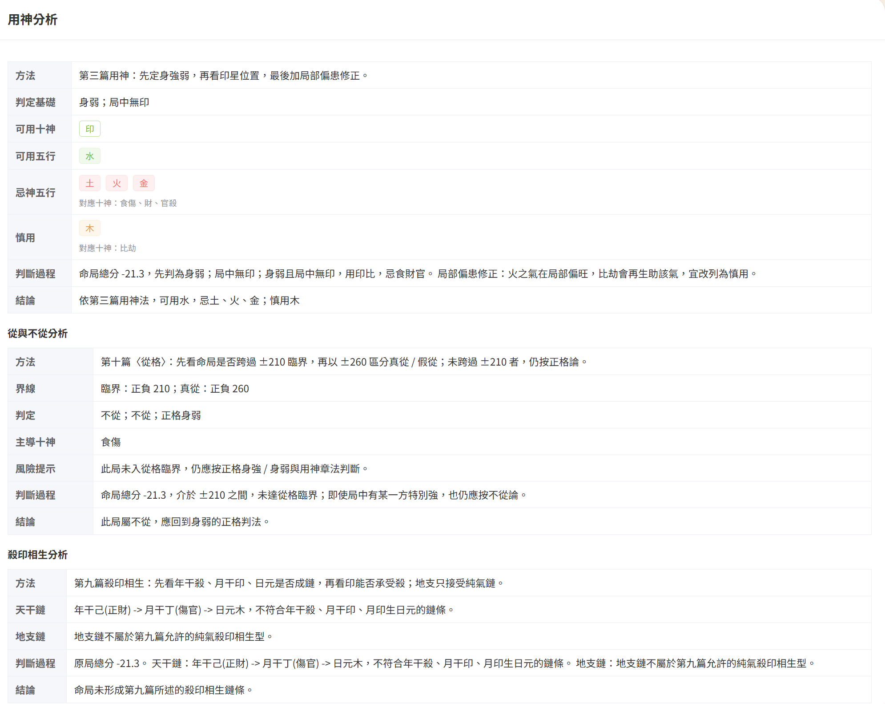

# 八字排盤 BaZi Desktop

一套以 `Tauri 2 + Vue 3 + TypeScript + Rust` 打造的本機八字排盤 App。  
核心排盤、四柱分析、運勢與量化模型都在本機執行，目標是同一套邏輯同時支援 Windows 桌面與 Android 手機。

## 亮點

- **本機 Rust 引擎**：排盤、四柱拆解、順逆排運與量化分析不依賴外部 API。
- **桌面與手機共用核心**：Windows installer 與 Android APK 使用同一套 Rust 計算邏輯。
- **手機友善版面**：單欄操作、輸入區自動收合、結果定位到頂部，適合小螢幕反覆查看。
- **直接輸入四柱**：可用於書籍命例、測試資料與已知四柱案例；需要時再推算可能西元年。
- **量化分析視圖**：提供五行力、天干地支分數、大運與流年量化參考。
- **列印命盤**：內建命盤列印預覽，方便整理與輸出。

## 執行畫面

### 四柱與柱位關係圖



### 大運、流年與互動關係



### 用神分析與格局判斷



## 功能總覽

### 出生資料排盤

- 支援公曆與農曆輸入
- 支援西元與民國年
- 支援時分輸入與時辰輸入
- 支援晚子時流派與起運流派設定
- 顯示命盤摘要、四柱、日主、格局、胎元、命宮、身宮與起運資訊

### 直接輸入四柱

- 年、月、日、時四柱可直接選取天干地支
- 不會預設推算西元年，分析速度更快
- 需要候選生日時可另外按 `推算西元年`
- 可帶回出生資料輸入模式做完整排盤

### 運勢與分析

- 大運、流年、流月展示
- 原局與運勢加入後的合、沖、刑、破互動
- 用神、從格、不從、殺印相生等分析
- 量化五行力、天干地支計分、大運與流年量化結果

## 技術架構

| 層級 | 技術 |
| --- | --- |
| UI | Vue 3、TypeScript、Element Plus、Vite |
| App Shell | Tauri 2 |
| 核心計算 | Rust |
| 曆法核心 | `tyme4rs` |
| 目標平台 | Windows、Android |

## 快速開始

```bash
npm install
npm run tauri:dev
```

前端開發：

```bash
npm run dev
```

前端建置：

```bash
npm run build
```

## 打包

Windows installer：

```bash
npm run tauri:build
```

輸出位置：

```text
src-tauri/target/release/bundle/nsis/
src-tauri/target/release/bundle/msi/
```

Android APK：

```bash
npm run tauri:android:apk
```

輸出位置：

```text
src-tauri/gen/android/app/build/outputs/apk/arm64/release/
```

Android AAB：

```bash
npm run tauri:android:aab
```

## 版本

目前版本：`1.0.3`

主要版本設定位置：

- `package.json`
- `src-tauri/tauri.conf.json`
- `src-tauri/Cargo.toml`

Android 版建置時會依版本產生對應的 `versionName` 與 `versionCode`。

## 專案方向

這個專案正在把原本偏 Web/API 的八字排盤流程逐步收斂成可離線執行的本機 App。後續會持續強化：

- 桌面與手機版互動一致性
- 量化模型與分析說明
- 列印版型與分享輸出
- Android 操作流暢度與啟動速度
